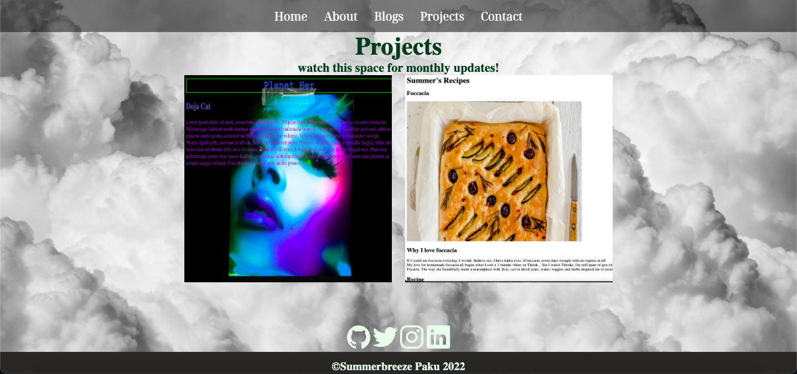

# portfolio website
https://www.summerbreeze-paku.com/
# github repo
https://github.com/SummerbreezePaku/T1A2_Portfolio

# Description
---

## Purpose
The purpose of my portfolio website is to showcase my talent and coding experience for potential employers in the web dev world. To be able to show my work ethics and coding skills as a beginner I worked tirelessly to create the best portfolio website I could in hopes the potential employer can see how much effort Im willing to try and learn. With my creative design I am hoping to showcase my talent to a high-end design company that constantly lookin for innovation and creativity..

## Functionality
My main goal in my portfolio website, was to create a functional website and showcase my creative skills but also  the viewer are able to see samples of my work, read my blogs or professional background and get in contact with me easily in one site.

## Features
- **Responsiveness** that expands the view of the website it different formats such as a phone(320px-634px), tablet(635px-992px) or desktop(993px-1200px). 
- **Navigation Bar** In the header of all pages, placed for easy access to flick through between pages, its as simple as one click.
- **CSS** to style and create various designs for individual components such as:
  - **Cards** to hold graphical images, text and in some instances, hyperlinks to a sub page.
  - **Headings and Subheadings** for the tile and subtitle of the page the view is on.
  - **Background Image** placed in the center of screen without being stretched or multiplied, but fixed to the screen size.
  - **flexbox** used to help create responsivness and positioning contents accordinly.
  - **Images** placed in cards aligning with text.

  - **text** holding information and required specific styles for easy readability.
  - **media queries** are used to change styling for equal responsivness for a mobile, tablet, dektop view
- **Containers** are to hold content as a group to help with positioning in styling and responsiveness.

- **Social Media Icons** links to my external social media pages.

- **hyperlink button to download pdf** for downloadble Resume

## Sitemap

## Screenshots
below are screenshots of a desktop view of my portfolio. Docs folder contain the mobile and tablet view.

## Target Audience
The targeted audience is ideally an IT professional employer seeking a web developer. I wanted to make my website stand out with creativity and express my interests through my design. 
## Tech Stack
 - HTMl
 - CSS
 - Adobe Photoshop
 - Github
 - Netlify

## Reflection
There were many parts of my assignment I didnt fully understand but I am willing to reflect and learn from it. There were some pages in my website I was unable to make responsive as I would have liked but I gave it a go and did  the best I could. Upon reflection I undestand I didnt fully understand the concept of mobile first design, which is fine and a great learning experience for next time. As this is my first ever experience creating a website, I am happy and content with what i've done and look forward to learn from my feedback.

